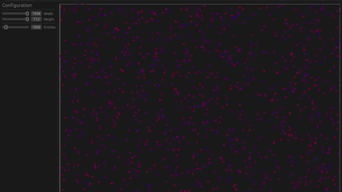

<h1 align="center">Fish Shoal Simulator</h1>

Interactive fish shoal simulator based on local rules to explore collective motion, phase transitions, and realistic
flock behaviors.

## Downloads

|                                                             Windows                                                             |                                                           Linux                                                           |                                                           MacOS                                                           |
|:-------------------------------------------------------------------------------------------------------------------------------:|:-------------------------------------------------------------------------------------------------------------------------:|:-------------------------------------------------------------------------------------------------------------------------:|
| [\>> Download <<](https://github.com/NickSpyker/fish-shoal-simulator/releases/latest/download/fish-shoal-simulator-windows.exe) | [\>> Download <<](https://github.com/NickSpyker/fish-shoal-simulator/releases/latest/download/fish-shoal-simulator-linux) | [\>> Download <<](https://github.com/NickSpyker/fish-shoal-simulator/releases/latest/download/fish-shoal-simulator-macos) |

### Demo

## License

See [LICENSE-APACHE](./LICENSE-APACHE) and [LICENSE-MIT](LICENSE-MIT) for details.
